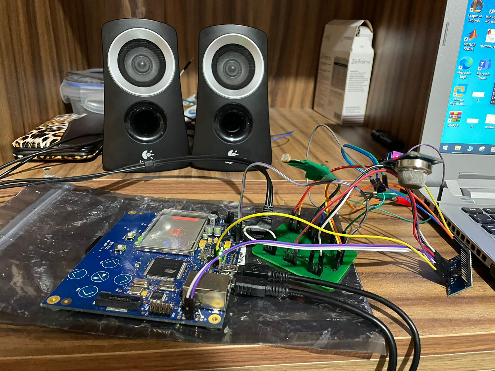

# Embedded System Laboratory 

 
-----------------

All lab codes are uploaded. A final project using EVK1105 was developed. The course and the content is in spanish. 

##  Final project with report written in spanish 
This project is mainly focused on the recapitulation and situational appliance of a broad range of qualities of embedded systems, for this particular case EVK1105 was used for the course. By using this board, audio systems can be developed thanks to its specialized audio hardware TWI-TPA6130. Several analogic sensors where used to capture data and a ADC multiplexer was used to allow the use of multiple analogic sensors with few pins. The audio system and de LCD display were used to inform the user about the status. Additionally, the project was developed using FreeRTOS because it provides fast and optimal performance for by managing the tasks of the system. 

https://github.com/Alfzzz/Embedded-System-Lab/blob/main/proyecto%20final/proyectofinalClubPenguin/Reporte%20Final%20.pdf

 
## Final project video: 

https://youtu.be/nGq4vpXIkYM
